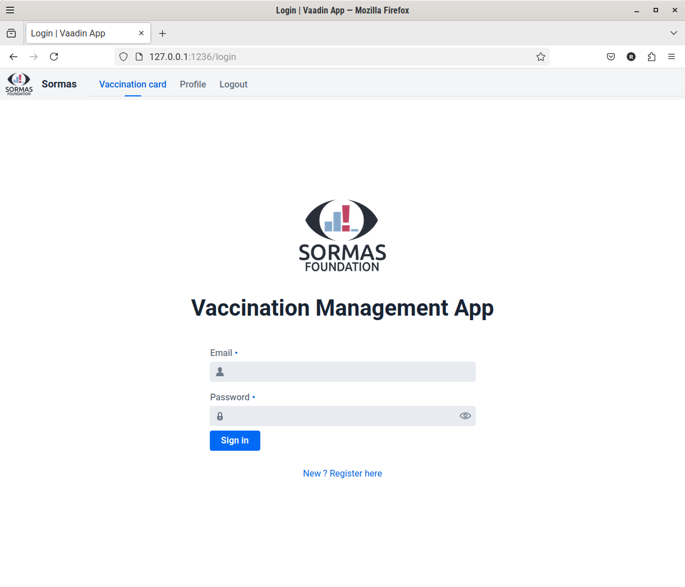

Sormas
==========
Carnet de Vaccination Electronique.

_Exercice pratique consistant à développer un carnet de vaccination électronique, en utilisant les technologies
employées dans l’application SORMAS._

# Installation

## Prerequisites

- Java 17
- Maven 3.8.1

## Build

    mvn clean test

    [...]

    [INFO] Results:
    [INFO]
    [INFO] Tests run: 32, Failures: 0, Errors: 0, Skipped: 0
    [INFO]
    [INFO] ------------------------------------------------------------------------
    [INFO] BUILD SUCCESS
    [INFO] ------------------------------------------------------------------------
    [INFO] Total time:  8.430 s

## Running

    mvn spring-boot:run # dev mode

Or

    mvn clean package -Pproduction # build for production

    java -jar target/exercise-0.0.1-SNAPSHOT.jar

Visit the application at [http://localhost:1236/login](http://localhost:1236/login)

## Screenshots

# Observations

## Met criteria

- [x] CVE1
- [x] CVE2
- [x] CVE3
- [x] CVE4
- [x] CVE5

## Unmet criteria

- [ ] Java 8

Old Nodejs dependencies were just not available anymore to run a java8 version of Vaadin on my systems. I resorted to using
java17 to develop the application.